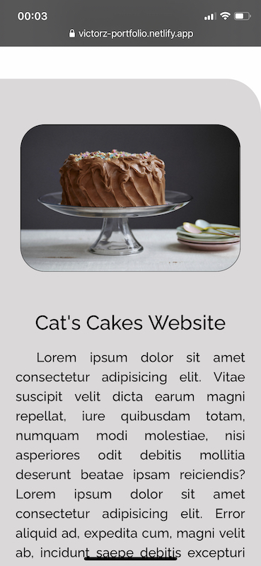

# Portfolio - 2020

---

## Links

Website: https://victorz.netlify.app

GitHub: https://github.com/victorzottmann/portfolio

# Purpose

---

The purpose of this portfolio is to demonstrate my web development skills and personality to potential employers; it intends not only to attract employers in IT, but also from the creative industries. The site is meant to be the go-to place to find out about my recent creative outputs and to get in contact with me.

# Functionality and Features

---

Comprising a simple and friendly user interface, the website is directed to all audiences. The navigation bar is home to all available pages (Home, Projects, Blog, and Contact), as well as the links to social media. The Home page introduces the visitors to myself, guiding them through a brief description of my background, a direct link to my CV, and my current technology skills and education. Similarly, the *Projects* page outlines recent projects and directly links them to their live preview and GitHub repositories. The *Blog* page consists of articles on a variety of topics, ranging from lifestyle to highly technical ones. Finally, the Contact page is as straightforward as it gets, consisting only of an invite to connect and a form so that the audience can reach out to me via email. 

The website was also made responsive so that users can interact with it on their mobile devices. In order to maximise the use of space in smaller screen sizes, the social media links located in the navigation bar were moved to the footer.

# Sitemap

---

# Screenshots

---

## Desktop View

---

### Home Page

---

### Projects Page

---

### Blog Page

---

### Articles

---

### Contact Page

---

## Mobile View

---

### Home Page - Tablet

---

### Projects Page - Tablet

---

### Blog - Tablet

For some reason the gap between each card is broken when viewing on an iPad, even though the layout behaves as it should in the mobile view in Chrome's developer tools. The same happens in landscape mode.

#### Blog - Landscape - Tablet

---

### Articles - Tablet

---

### Contact Page - Tablet

---

### Phone - Home, Projects, Blog, Articles and Contact Pages, respectively

---

  

  

   

 

# Target Audience

---

This project is available to all audiences, and is specifically targeted to potential employers in web development.

# Technology Stack

---

- HTML
- CSS
- Sass / SCSS
- Git and GitHub
- Netlify (for website deployment)

# Additional Resources

---

- Google Fonts
- Iconify (for social media icons)
- Coolors (for color palette)
- Balsamiq (for wireframes)

# References

---

I followed a YouTube tutorial in order to make the blog posts card.

Codes, J. (2020). *How To Create a Responsive Blog Post Card | HTML and CSS Tutorial.* [Video file]. Retrieved from https://youtu.be/4I-b6tIg52w

